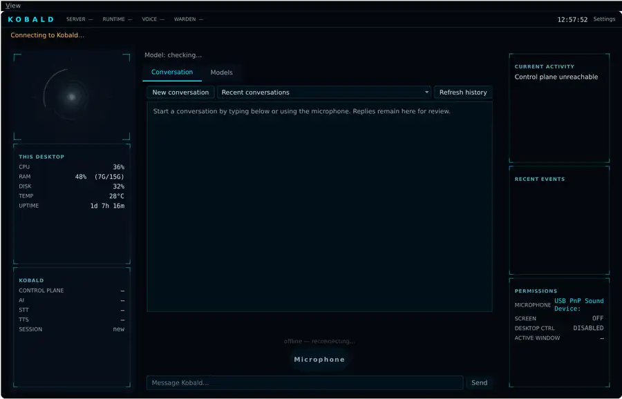
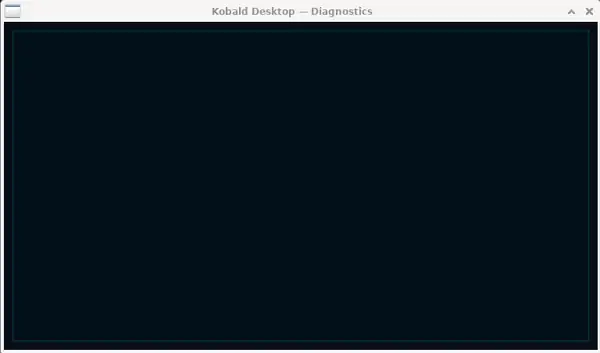

<p align="center">
  
</p>

# Kobald

A student led project focused on transparent evidence, accountable decisions and controlled local development.

Kobald is a student led, locally operated AI and smart systems project based in Mount Gambier, South Australia. It gathers and compares evidence, identifies contradictions, preserves where information came from, communicates uncertainty, and keeps important decisions and external actions under human control.

**Governing principle: evidence before authority.**

Kobald is intended to assess claims using available evidence rather than social status, popularity or authority. It does not claim to be completely unbiased. Evidence, models, sensors, questions and human rules may all contain bias; Kobald is designed to make those limitations, contradictions and decisions more visible and auditable.

## The Problem

Most AI systems ask people to trust an answer. Kobald asks them to inspect the evidence and reasoning behind it.

## Desktop Interface

Kobald also has an early desktop Command Centre under active development. The interface is intended to provide one place to view system state, interact with Kobald, select models, configure local audio devices and inspect diagnostics.

The screenshots below are development builds. They show the interface as it exists now rather than a finished product.

### Command Centre

<p align="center">
  
</p>

The current desktop interface exposes local system information, conversation controls, model selection areas, permissions and runtime status. This screenshot was captured while the client was disconnected from the Kobald server.

### Settings

<p align="center">
  
</p>

The settings view currently provides server configuration, local speech output, microphone selection, audio output selection and background tray behaviour. The server address has been redacted from the public screenshot.

### Diagnostics

<p align="center">
  
</p>

The diagnostics view is still under development and is intended to expose runtime and connection information in a dedicated view.

## Current Project Stage

Kobald is an early working software foundation, not a finished product or deployed industry system. Its evidence workflow and human review controls are implemented and covered by an offline automated test suite.

**Tagged release baseline:** v0.8.0 with 295 tests passing and 1 skipped  
**Latest development candidate:** v0.9.0 release candidate at commit `84ad876`  
**Candidate test status:** 604 passing, 1 skipped opt in live smoke test  
**Release status:** pushed to private `main`; not tagged and no remote CI result has been verified  
**Runtime:** Python standard library; offline demonstrations require no cloud service

## What Works Now

* Controlled ingestion from allowlisted local sources
* Evidence provenance and transparent quality signals
* Separate preservation of evidence for and against a conclusion
* Explicit contradictions, uncertainty and bounded confidence
* Human readable evidence briefs
* Persistent human review queue
* Approve, reject or request more evidence decisions
* Links between research sessions and confidence tracking
* Nine deterministic offline evaluation cases
* Complete deterministic offline demonstration using invented safe public data
* Structured audit records and secret redaction
* Early desktop Command Centre with conversation, model, settings and diagnostics views

## v0.9 Release Candidate Additions

The latest development candidate adds a bounded provider layer for deterministic mock responses, local Ollama and consent gated cloud models. These additions are implemented and covered by the offline test suite, but have not yet been demonstrated through a successful live Ollama request.

* Persistent cloud permission plus confirmation for each invocation
* Loopback only local provider URLs and trusted host cloud validation
* Redirect and environment proxy blocking for provider requests
* Strict source linked response validation that rejects fabricated references
* Metadata only live audit records without raw prompts or responses
* A read only AI connectivity check that sends no evidence
* An invented evidence live demonstration that never approves its own result

## Evidence Flow

```text
Question or material
    → controlled ingestion
    → evidence retrieval with provenance
    → evidence for and against kept separately
    → contradiction and uncertainty analysis
    → provisional conclusion
    → human review
    → approved knowledge or no action
```

## Human Review and Safety

* No autonomous approval
* No unrestricted shell access
* No arbitrary file editing outside controlled Kobald records
* No live device control
* No automatic messages, purchases, Git pushes or other external actions
* No model training or fine tuning
* New evidence begins unreviewed and is not automatically treated as truth
* Demonstrations use invented data and run offline
* High impact decisions remain subject to human review
* Evidence is not sent to a cloud provider without persistent permission and confirmation for that invocation
* All conclusions from live providers remain provisional and require human review

## Current vs Future

| Implemented foundation | Potential future application |
|---|---|
| Evidence provenance and quality signals | Agriculture and environmental monitoring |
| Evidence briefs for human review | Education and research assistance |
| Confidence calibration without model training | Small business knowledge systems |
| Offline evaluation harness | Trades and maintenance documentation |
| Controlled local ingestion | Logistics and operational analysis |
| Cross session evidence linking | Cybersecurity evidence triage |
| Human review queue | Controlled sensor integration |
| Deterministic offline demonstration | Semantic similarity retrieval |
| Early desktop Command Centre | Broader multi model and local system orchestration |

Future possibilities are not current deployments.

## Why More Compute Matters

The current Kobald foundation can be developed and tested on comparatively modest hardware, but the next stages of the project are intended to move more AI work onto local systems.

More capable local compute would make it practical to:

* run substantially larger models locally rather than depending as heavily on cloud services
* compare multiple models and configurations under the same controlled workflow
* experiment with model adaptation, fine tuning and training in later development stages
* support future multimodal work involving vision, audio and sensor data
* test longer running research and agent workflows locally
* preserve more sensitive development and project data on local infrastructure
* explore distributed AI workloads as the project matures

These are development goals. They are not claims of functionality already implemented in Kobald.

### Why hardware such as NVIDIA DGX Spark is relevant

A high memory local AI system such as NVIDIA DGX Spark would give Kobald a much larger development ceiling than the project's current hardware. It would allow larger local models, more demanding experiments and future model training work to be explored without requiring enterprise scale infrastructure.

A dual system configuration would also create the option to experiment with high speed distributed AI workloads later in the project. That is a future development target, not a current capability.

## Demonstration

Kobald includes a repeatable offline demonstration covering controlled ingestion, duplicate and unsafe path rejection, evidence analysis, provisional confidence, human review, a second evidence session, links between research sessions comparison, evaluation and preserved audit history.

The demonstration uses invented solar panel material, mock AI responses and no live hardware or network access. It demonstrates the workflow and safety boundaries; it does not prove that every conclusion is true or that Kobald is ready for production.

The v0.9 provider layer has been tested offline with mock providers. No successful live Ollama request has yet been demonstrated.

## Potential Local Applications

These are possible future directions, not claims of present deployment:

* **Agriculture:** comparing sensor readings, weather and historical observations before suggesting the next inspection
* **Education:** helping students examine supporting and opposing evidence
* **Small business:** preserving procedures, decisions and project handovers
* **Trades and maintenance:** recording service evidence, outcomes and lessons
* **Logistics:** comparing operational records and identifying contradictions
* **Cybersecurity:** organising evidence from multiple alerts while leaving action with a person

## Project Direction

The next stage is a controlled local prototype using suitable computing hardware, reliable storage, power protection, an isolated sensor network and a small number of read only environmental sensors. Real world capability will be introduced gradually, tested separately and kept behind explicit human approval.

The complete technical source, test suite and developer documentation are maintained separately and can be made available to appropriate reviewers on request.

## Support and Sponsorship

Kobald is developed independently by Cameron Lonnie in Mount Gambier, South Australia.

Hardware support, technical mentorship and project review can directly help expand local AI development, testing and future smart systems work. Any donated or sponsored hardware would be used as development infrastructure for Kobald rather than represented as evidence that unfinished capabilities already exist.

For project enquiries or technical review, contact can be made through the GitHub profile associated with this repository.
