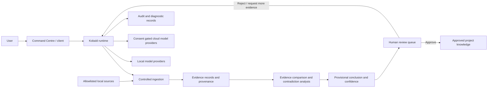

# Kobald Public Architecture Overview

This document describes Kobald at a system level without publishing the private implementation, internal source layout, credentials, infrastructure addresses or security sensitive configuration.

The purpose of this document is to show how the major parts of Kobald fit together and where human review, model access and evidence handling sit in the system.

## System view

## Main boundaries

### Command Centre

The desktop interface is the main human facing control surface. It is intended to provide conversation controls, model selection, local device settings, runtime status and diagnostics without requiring a user to work directly in the underlying runtime.

### Kobald runtime

The runtime coordinates research sessions, evidence handling, model access, review state and audit information. The public showcase intentionally does not publish internal route names, private source structure or implementation details.

### Evidence pipeline

Kobald is designed around preserving where information came from and separating evidence that supports a conclusion from evidence that challenges it. Contradictions and uncertainty are treated as information that should remain visible rather than being silently flattened into a single answer.

### Human review

Important conclusions remain provisional until a person reviews them. New information is not automatically promoted into trusted project knowledge, and external actions are not treated as approved merely because a model suggested them.

### Model providers

Kobald supports a bounded provider layer for deterministic mock responses, local model providers and consent gated cloud providers. Cloud use is designed to remain explicit rather than silently sending evidence outside the local environment.

### Audit and diagnostics

Audit and diagnostic records are intended to make important system activity inspectable while avoiding unnecessary storage of sensitive raw prompts or credentials.

## Current and future boundaries

| Area | Current public status | Future direction |
|---|---|---|
| Evidence provenance | Implemented foundation | Broader source types and richer retrieval |
| Contradiction handling | Implemented foundation | Larger cross session comparisons |
| Human review | Implemented foundation | More granular permissions and action review |
| Local model access | Provider layer implemented | Larger local models and broader multimodal testing |
| Cloud model access | Consent gated provider layer | Additional providers while preserving explicit consent |
| Desktop interface | Early development build | More complete system control and diagnostics |
| Sensors | Not a current deployment | Controlled read only sensor integration |
| Computer control | Not represented here as a finished capability | Future controlled tool and system interaction |
| Distributed AI | Not a current capability | Possible multi system experimentation later |

## What is intentionally not public

The showcase repository does not contain the complete Kobald source tree, private test suite, infrastructure configuration, credentials, internal deployment information or security sensitive implementation details.

Those materials are maintained separately. Appropriate technical reviewers can be given additional evidence privately when there is a legitimate review need.